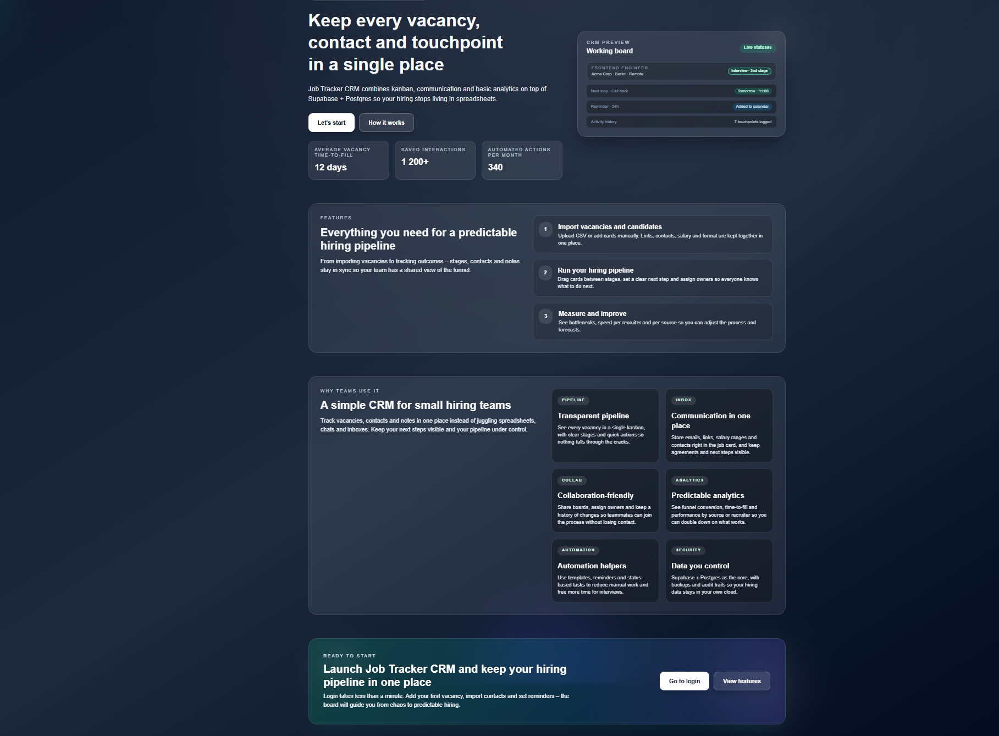
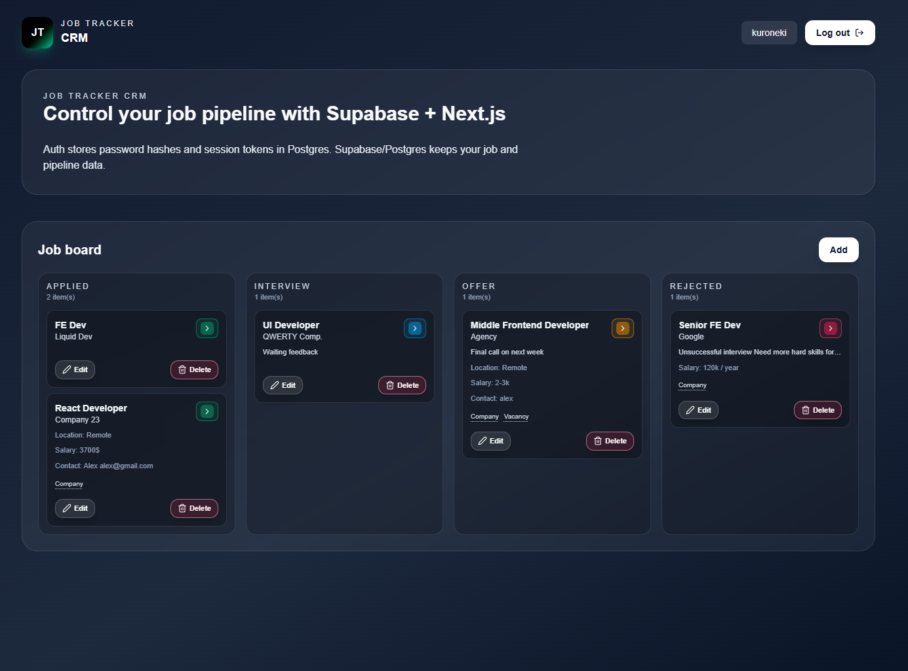
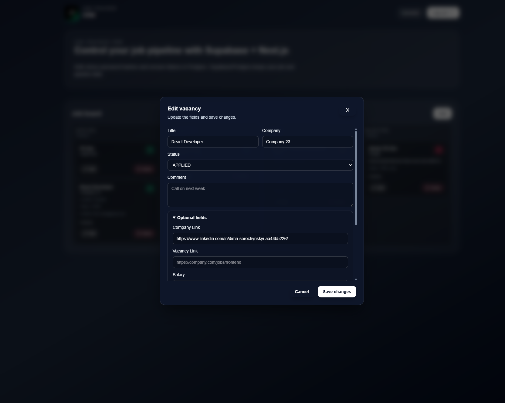

# Job Tracker CRM

Personal CRM for tracking job applications, built with **Next.js App Router**, **React 19**, **Tailwind 4**, **Prisma** and **Postgres**.

Live demo: https://job-tracker-sh8g.vercel.app/

Modern kanban-style board with columns per status, rich modals for job details, and a small landing page on top.

## Screenshots





---

## Features

- **Auth + personal data**
  - Separate data per user.
  - All mutations go through Next.js Server Actions.

- **Job board**
  - Columns for `APPLIED`, `INTERVIEW`, `OFFER`, `REJECTED`.
  - Drag & drop between columns with optimistic UI.
  - Quick status change from `JobCard` via a colored status button.

- **Modals**
  - `NewJobModal` is used for both creating and editing a job (driven by props and URL state).
  - Modal open/close state is synchronized with the URL query (`?modal=...`).
  - Large form with optional fields (links, salary, location, contact, next step).

- **UI / UX**
  - Custom components: `Button`, `Modal`, `JobCard`, `JobBoard`.
  - Animations via `framer-motion`.
  - Column highlighting while dragging.
  - Toasts (`ToastProvider`) for success/error feedback on create/update/delete.

- **Tech Stack**
  - **Frontend**: Next.js 16 (App Router), React 19, Tailwind 4.
  - **Animations**: Framer Motion.
  - **DB**: Postgres + Prisma ORM.
  - **Styles**: Tailwind + custom components.

---

## Getting Started

1. Install dependencies:

```bash
npm install
```

2. Configure environment:

- Create `.env` (for example from `.env.example` if you add one).
- Set your `DATABASE_URL` for Postgres.
- Run migrations / `prisma generate` if needed (`npm run postinstall` already calls `prisma generate`).

3. Run dev server:

```bash
npm run dev
```

Open `http://localhost:3000` to see the app.

## Development Notes

- The main authenticated page is `src/app/page.tsx`.
- Core UI components live in `src/components/`:
  - `JobBoard.tsx`, `JobCard.tsx`
  - `Modal.tsx`, `NewJobModal.tsx`
  - `ToastProvider.tsx`, `FormSubmitButton.tsx`, `Button.tsx`
- Server-side logic for jobs is in `src/lib/jobs.ts`.

## Ideas for Future Work

- Filters / search by company, title, location.
- Tagging (stack, seniority, region).
- Analytics (conversion per stage, time in status).
- Import/export CSV.
- Demo user / seeded data for public demo.

### AI-powered features

- **Resume parsing & summary**: upload a PDF/DOCX resume, send it to an LLM (e.g. Claude 3.5) and automatically extract key fields (title, seniority, stack, years of experience, locations, languages). Save them into structured columns so you can quickly understand a candidate at a glance.
- **Vacancy understanding from text/URL**: paste a job description or a link to a vacancy, let the model detect required skills, level (junior/mid/senior), salary range hints and location, and pre-fill a new job card with this data.
- **Fit score & notes**: for each job + resume pair, ask the model to compute how well they match (e.g. 0–100) and generate a short explanation (why it’s a good or weak match). Store this as an extra field/notes in the Job Card.
- **Next-step suggestions**: based on current status (APPLIED / INTERVIEW / OFFER / REJECTED) and your notes, generate suggestions like “what to send next”, “what to clarify on a call” or “how to negotiate an offer”, and save the chosen suggestion into the `nextStep` field.
- **Cover letter / email drafts**: generate personalized email templates (outreach, follow-up after interview, thank you note, offer negotiation) using the job description + candidate resume + your own tone, so you can copy-paste and tweak instead of writing from scratch every time.
